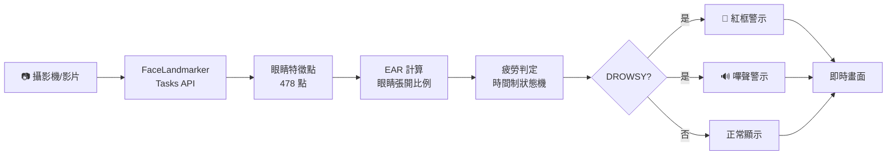
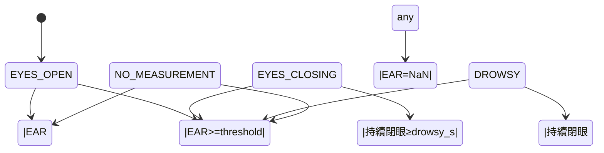

# DMS 架構與設計決策

## 總體流程



## 模組層次

```
scripts/
  ├─ run_dms.py              (進入點:完整 pipeline)
  └─ test_camera_facemesh.py (冒煙測試:偵測鏈路驗證)
src/dms/
  ├─ face.py                 (MediaPipe Tasks API 封裝)
  │  └─ FaceLandmarkerVideo:context manager,自動模型下載、BGR轉換、timestamp 遞增
  ├─ ear.py                  (EAR 純函式,EAR = (h1+h2)/(2w))
  │  ├─ compute_ear():單眼 EAR 計算
  │  ├─ eye_points_from_landmarks():正規化座標→像素座標
  │  └─ average_ear():雙眼平均,NaN 容錯
  ├─ drowsiness.py           (時間制狀態機)
  │  ├─ DrowsinessConfig:參數(ear_threshold, drowsy_seconds)
  │  └─ DrowsinessDetector:狀態遷移邏輯
  └─ alert.py                (警示層)
     ├─ draw_alert():紅框+狀態列
     ├─ SoundAlert:嗶聲+冷卻
     └─ make_beep():numpy 合成正弦波
configs/
  └─ default.yaml            (所有參數外部化)
tests/
  ├─ test_ear.py             (18 tests:EAR 公式驗證)
  ├─ test_drowsiness.py      (20 tests:狀態機邏輯)
  └─ test_alert.py           (12 tests:波形/冷卻/畫素)
```

## 核心設計決策

### 1. EAR 計算

**選擇:純函式 + 正規化座標換回像素座標**

```python
# MediaPipe 給正規化座標(0~1),但眼睛特徵點若要計算 EAR(比例)
# 在非正方形影像會被長寬比扭曲,所以要先乘回像素尺度

EAR = (||p2-p6|| + ||p3-p5||) / (2·||p1-p4||)
# p1,p4:眼睛水平兩端
# p2,p6;p3,p5:上下眼瞼成對點
```

**Why:**
- 純函式:單元測試無需攝影機或 MediaPipe,測試速度 O(1)
- 對平移/旋轉/等比縮放不變,適合跨人臉跨距離
- 特徵點 index 對官方 `FaceLandmarksConnections` 驗證過

### 2. 時間制(非幀數制)疲勞判定

**選擇:連續閉眼秒數而非幀數**

```yaml
drowsy_seconds: 1.0  # 1 秒
ear_threshold: 0.2   # 實測:張眼~0.30、閉眼<0.02
```

**Why:**
- FPS 隨裝置漂移(筆電~30,Pi~10~15),幀數門檻部署後失準
- DDAW 法規以秒為單位
- 實測資料驅動:現場 live test 得出 EAR 數值,直接套用

**實測數據(筆電,2026-06-12):**
| 狀態 | EAR |
|---|---|
| 雙眼張開 | ~0.30 |
| 單眼閉 | ~0.15 |
| 雙眼閉 | <0.02 |

→ 門檻 0.2 充足,單眼閉(眨眼)也會低於門檻(開車閉單眼超過1秒值得警示)

### 3. NaN 不累積、不重置

**狀態:**
- 臉沒抓到/特徵點退化 → EAR = NaN
- NaN 時:**不進行時間累積,但也不清零** `_closed_since`
- 臉回來仍閉眼 → 從原起點繼續算

**Why:**
- 短暫掉偵測(0.1~0.3s)不應清掉已累積的閉眼時間
- 但「沒看到」也不能當「閉眼」累積(會誤觸)
- 設計為無狀態容錯,符合「邊緣設備不穩定」現實

### 4. 聲音跨平台 + 可測

**選擇:numpy 合成 + sounddevice 播放 + 可注入 player**

```python
# sounddevice 是 mediapipe 附帶的依賴,不增加新相依
# numpy 合成波形:跨平台、部署到 Pi 無差別、無需 winsound
# player 可注入:單元測試傳假 player,驗證冷卻邏輯不需喇叭

sound = SoundAlert(player=_fake_player)  # 測試環境
sound.trigger(now=0.0)  # 無聲驗證
```

**冷卻機制:**
```python
cooldown_s: 1.5  # DROWSY 連續多幀也最多每 1.5s 嗶一次
```

### 5. Tasks API(非舊版 mp.solutions)

**背景:mediapipe 0.10.3x 移除了舊版 `mp.solutions.face_mesh`**

- `face.py` 統一 Tasks API 使用
- `FaceLandmarkerVideo` 負責:模型下載、BGR 轉換、timestamp 管理
- 兩支 scripts(冒煙測試、pipeline)共用 → 減少樣板碼

## 狀態機詳解



**關鍵:**NO_MEASUREMENT 時不改變 `_closed_since`,臉回來繼續算。

## 參數外部化

```yaml
drowsiness:
  ear_threshold: 0.2     # EAR 門檻,低於此值視為閉眼
  drowsy_seconds: 1.0    # 連續閉眼秒數,達此值判定為疲勞

alert:
  beep_frequency_hz: 880    # A5 音高(爽朗、易察覺)
  beep_duration_s: 0.4      # 400ms(不過長)
  beep_cooldown_s: 1.5      # 防洗版
  beep_volume: 0.5          # 0.0~1.0

camera:
  width: 640
  height: 480
```

改參數只需編輯 YAML,無需改程式碼。

## 法規對應

**歐盟 GSR(General Safety Regulation)** — 2026/7 起新車強制
- **ADDW**(Advanced Driver Distraction Warning):駕駛分心警示
- **DDAW**(Driver Drowsiness and Attention Warning):駕駛疲勞/注意力警示

本專案對應 **DDAW**:
- 用 EAR 偵測連續閉眼(疲勞信號)
- 時間門檻(1 秒)符合反應要求
- 邊緣端本地運算(不依賴雲、隱私合規)

## 測試策略

- **EAR**(18 tests):手算期望值、縮放/平移/旋轉不變性、退化保護
- **狀態機**(20 tests):眨眼不誤觸、恰達門檻、NaN 斷檔、30 FPS 完整情境
- **警示**(12 tests):波形質量、冷卻邏輯、紅框畫素

**全部無頭**:不需攝影機、不需 GUI、不需喇叭 → CI 友善、跑得快(0.37s)。

## 部署路徑(階段二規劃)

1. **Raspberry Pi 5 / Jetson Nano**
   - FaceLandmarker 模型 INT8 量化
   - FPS/延遲 before-after 量測
   - 邊緣推理優化(CPU vs GPU)

2. **監控整合**
   - 疲勞事件上報(時間戳、EAR 值)
   - 多人 tracking(若干簽)
   - 數據存儲(SQLite/PostgreSQL)

3. **OTA 更新**
   - YAML 參數遠端下發(閾值微調)
   - 模型版本管理
